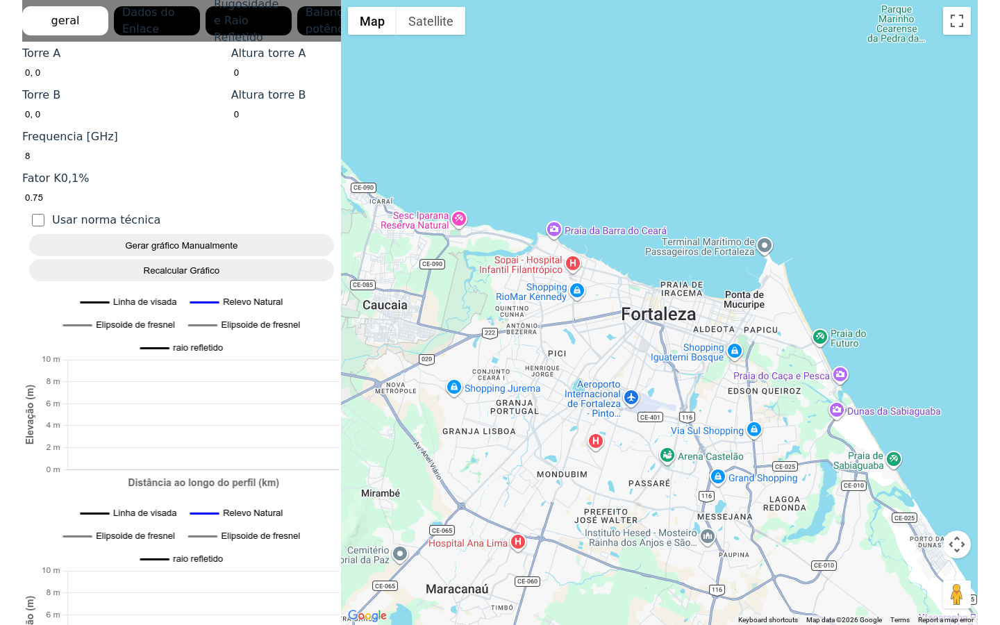
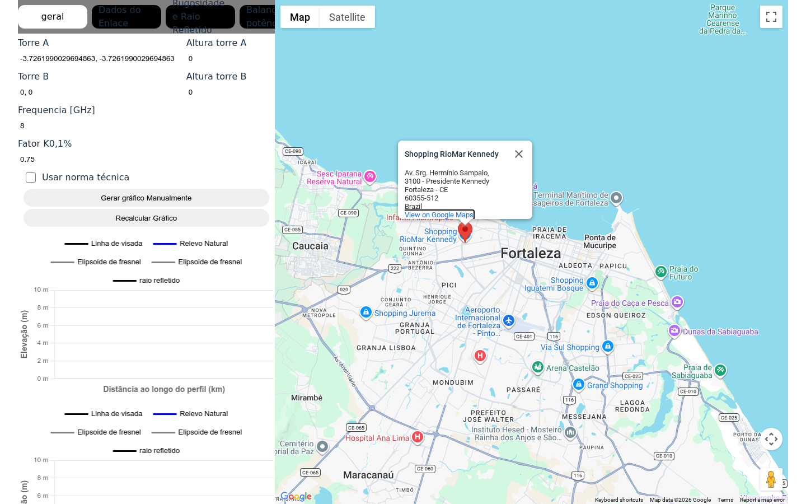
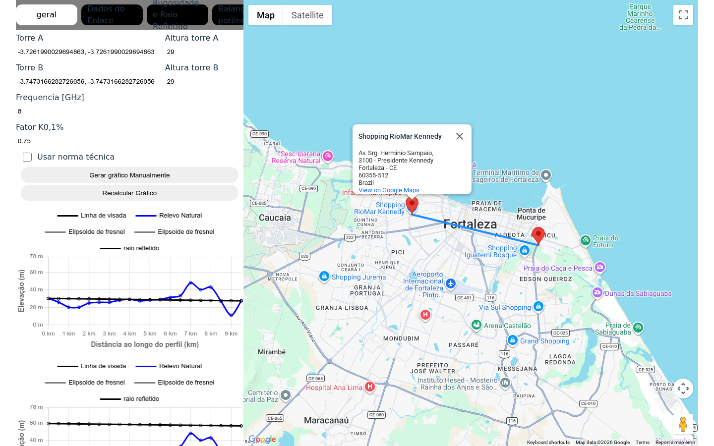
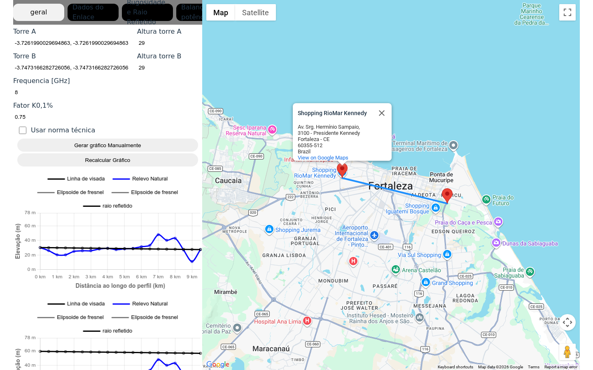
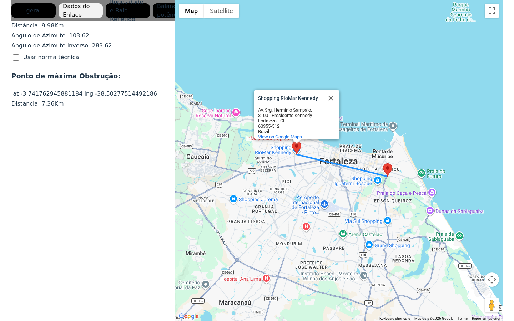
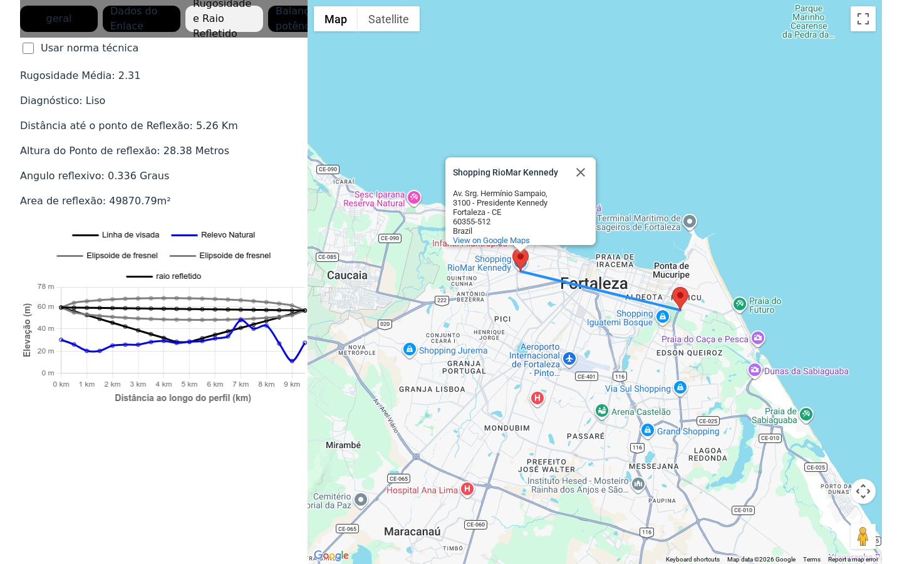
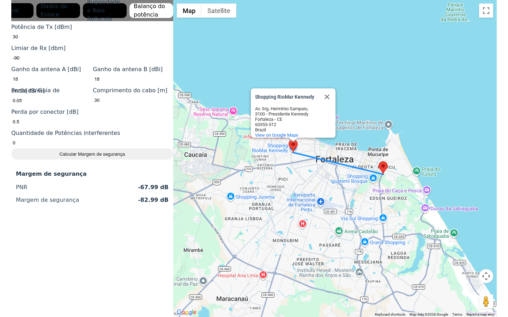
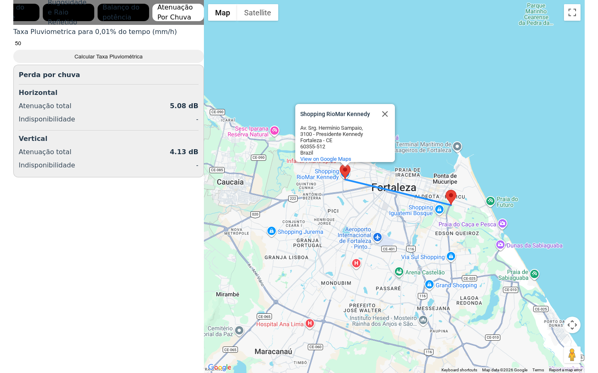

# Manual de utilização — tcc-remake

Aplicação web para **análise de enlaces de rádio ponto a ponto**: seleção de duas torres no mapa, perfil de terreno, elipsoide de Fresnel, rugosidade/reflexão, **balanço de potência** (margem de segurança com interferentes) e **atenuação por chuva**.

---

## Índice

1. [Introdução](#1-introdução)
2. [Requisitos e instalação](#2-requisitos-e-instalação)
3. [Visão geral da interface](#3-visão-geral-da-interface)
4. [Definir o enlace no mapa](#4-definir-o-enlace-no-mapa)
5. [Aba Geral](#5-aba-geral)
6. [Aba Dados do Enlace](#6-aba-dados-do-enlace)
7. [Aba Rugosidade e Raio Refletido](#7-aba-rugosidade-e-raio-refletido)
8. [Aba Balanço do potência](#8-aba-balanço-do-potência)
9. [Aba Atenuação Por Chuva](#9-aba-atenuação-por-chuva)
10. [Resolução de problemas](#10-resolução-de-problemas)
11. [Glossário breve](#11-glossário-breve)
12. [Anexo: recriar as imagens do manual](#12-anexo-recriar-as-imagens-do-manual)

---

## 1. Introdução

O **tcc-remake** permite:

- Escolher **Torre A** (origem) e **Torre B** (destino) no **Google Maps**, com elevação do terreno nos pontos.
- Ver o **perfil ao longo do trajecto**, a **linha de visada** e, após configurar frequência e alturas, o **elipsoide de Fresnel** e o **raio refletido** nos gráficos.
- Consultar **distância**, **azimutes** (directo e inverso) e o **ponto de máxima obstrução** ao feixe.
- Calcular **PNR** (nível de recepção previsto) e **margem de segurança** face ao limiar de recepção, com **várias potências interferentes**.
- Estimar **atenuação por chuva** e **indisponibilidade** associada (polarizações horizontal e vertical), com base na taxa pluviométrica e na margem já calculada.

Tecnologias: React, TypeScript, Vite, Google Maps (JavaScript + Elevação), Chart.js.

---

## 2. Requisitos e instalação

### Requisitos

- **Node.js** (recomendado 18 ou superior).
- **npm**.
- **Ligação à Internet** para carregar o mapa, imagens de satélite e o serviço de **elevação** do Google.
- Chave da **Google Maps JavaScript API** com APIs necessárias habilitadas (mapa, geometria, elevação). A chave está configurada na aplicação; em produção deve ser protegida por restrições de domínio e quotas.

### Instalar dependências

Na pasta raiz do projecto:

```bash
npm install
```

### Executar em desenvolvimento

```bash
npm run dev
```

Abra no navegador o endereço indicado no terminal (por omissão **http://localhost:5173**; se a porta estiver ocupada, o Vite pode usar **5174**, etc.).

### Compilar para produção (opcional)

```bash
npm run build
npm run preview
```

---

## 3. Visão geral da interface

A janela divide-se em duas zonas principais:

- **Coluna esquerda**: barra de **abas** (menu) no topo e, por baixo, o **painel** correspondente à aba seleccionada (formulários, valores e gráficos).
- **Coluna direita**: **mapa interactivo** (Google Maps), onde se marcam as torres e se visualiza a linha do enlace.



*Figura 1 — Layout principal: abas “geral”, “Dados do Enlace”, etc., e mapa.*

---

## 4. Definir o enlace no mapa

1. Com a aplicação aberta, **clique uma vez** no mapa para definir a **Torre A** (primeiro ponto). O marcador de origem é posicionado nesse local e a **elevação** desse ponto é obtida automaticamente.
2. **Clique novamente** noutro ponto do mapa para definir a **Torre B**. O segundo marcador move-se para esse local (cada novo clique **actualiza** a Torre B).
3. Entre as duas torres desenha-se uma **linha azul** (polilinha do enlace).



*Figura 2 — Exemplo após definir apenas a Torre A.*



*Figura 3 — Enlace completo com ambos os pontos.*

As **coordenadas** (latitude e longitude) são reflectidas nos campos **Torre A** e **Torre B** na aba **geral** (sincronizadas com o mapa). Pode ainda ajustar coordenadas manualmente nos campos e usar o botão **“Gerar gráfico Manualmente”** para recalcular a partir dos valores introduzidos (ver secção seguinte).

---

## 5. Aba Geral

Na aba **geral** configura-se o enlace e visualizam-se os primeiros gráficos de perfil.

### Campos principais

| Campo | Descrição |
|--------|-----------|
| **Torre A** / **Torre B** | Coordenadas em graus (formato `lat, lng`), actualizadas pelos cliques no mapa. |
| **Altura torre A** / **Altura torre B** | Alturas das antenas (estruturas), usadas nos cálculos de visada e Fresnel “sem obstrução” quando aplicável. |
| **Frequencia [GHz]** | Frequência de trabalho; afecta o elipsoide de Fresnel. Valor inicial típico na app: **8** GHz. |
| **Fator K0,1%** | Parâmetro **K** para reflexão (condição de refractividade). Valor inicial típico: **0,75**. |
| **Usar norma técnica** | Caixa de selecção que influencia o cálculo “sem obstrução” (norma técnica activa ou não). |


*Figura 4 — Aba Geral: coordenadas, alturas, frequência, K e acções.*

### Botões

- **Gerar gráfico Manualmente**: lê as coordenadas dos campos **Torre A** e **Torre B** e actualiza os pontos de cálculo (útil se editar as coordenadas à mão).
- **Recalcular Gráfico**: volta a gerar o elipsoide de Fresnel com a **frequência** actual.

### Gráficos

Há **dois** gráficos empilhados:

1. Perfil do terreno com **linha de visada** considerando obstruções ao longo do perfil.
2. Perfil com **linha de visada não obstruída** (referência sem a mesma obstrução ao terreno).



*Figura 5 — Gráfico superior: elevação do trajecto e visada.*


*Figura 6 — Gráfico inferior: visada “não obstruída”.*

O eixo horizontal representa a progressão ao longo do trajecto; o eixo vertical, **elevação** (metros). Os rótulos de distância no eixo X são aproximados conforme a implementação actual.

---

## 6. Aba Dados do Enlace

Esta aba mostra resultados **escalares** do enlace:

- **Distância** entre torres (em km).
- **Ângulo de azimute** (sentido A → B) e **azimute inverso** (B → A), em graus.
- O mesmo interruptor **Usar norma técnica** (coerente com a aba Geral).
- **Ponto de máxima obstrução**: coordenadas (lat, lng) e **distância** desde a origem ao longo do perfil (km).



*Figura 7 — Dados do enlace.*

---

## 7. Aba Rugosidade e Raio Refletido

Apresenta:

- **Rugosidade média** e **rugosidade no ponto** de reflexão, com **diagnóstico** “Rugoso” ou “Liso” conforme a comparação entre estes valores.
- **Distância até o ponto de reflexão**, **altura do ponto de reflexão**, **ângulo reflexivo** e **área de reflexão** (m²).
- Um **gráfico** com perfil, elipsoide de Fresnel (zonas superior e inferior) e **raio refletido**.



*Figura 8 — Rugosidade, reflexão e gráfico completo.*

Mantenha **Torre A**, **Torre B**, **frequência** e **K** coerentes com o cenário que pretende analisar; os gráficos dependem do trajecto e dos parâmetros físicos.

---

## 8. Aba Balanço do potência

Utilize esta aba para o **balanço de ligação** e a **margem de segurança**.

### Campos

- **Potência de Tx [dBm]**: potência transmitida.
- **Limiar de Rx [dbm]**: sensibilidade mínima aceitável do receptor (limiar).
- **Ganho da antena A [dBi]** e **Ganho da antena B [dBi]**.
- **Perda no Guia de onda [dB/m]** e **Comprimento do cabo [m]** (perda total proporcional ao comprimento).
- **Perda por conector [dB]** (o modelo de cálculo considera múltiplos conectores conforme a implementação).
- **Quantidade de Potências interferentes**: número **N** de interferentes a considerar.
- Para cada índice inferior a **N**, aparece um campo **Potência [dBm]** com a potência de cada interferente (valores em dBm, por exemplo `-98`).

### Acção

1. Preencha os campos com valores realistas do seu enlace.
2. Clique em **Calcular Margem de segurança**.

### Resultados

Aparece um cartão com:

- **PNR** — nível de recepção previsto na entrada do receptor (após ganhos e perdas modelados).
- **Margem de segurança** — folga em dB face ao limiar e aos efeitos de interferência modelados na aplicação.



*Figura 9 — Balanço de potência e margem.*

A margem calculada é utilizada internamente na aba de **chuva** (ver seguinte). Convém calcular a margem **antes** de interpretar os resultados de atenuação por chuva.

---

## 9. Aba Atenuação Por Chuva

1. Introduza a **Taxa Pluviométrica para 0,01% do tempo (mm/h)** (intensidade de chuva de projecto).
2. Clique em **Calcular Taxa Pluviométrica** (o rótulo do botão refere-se ao cálculo associado a essa taxa).

O painel mostra, para polarização **horizontal** e **vertical**:

- **Atenuação total** (dB).
- **Indisponibilidade** (valor numérico bruto devolvido pelo modelo implementado).



*Figura 10 — Atenuação por chuva e indisponibilidade.*

**Nota:** o cálculo utiliza a **margem de segurança** obtida na aba **Balanço do potência**. Se ainda não tiver premido **Calcular Margem de segurança**, a margem pode estar vazia ou inválida e os resultados de chuva podem não ser fiáveis. Calcule primeiro a margem com parâmetros coerentes.

---

## 10. Resolução de problemas

| Situação | O que verificar |
|-----------|-----------------|
| **Mapa cinzento ou sem carregar** | Internet; chave da API; consola do navegador (erros 403/429 por quota ou restrições). |
| **Gráficos vazios ou sem perfil** | Confirme que **Torre A** e **Torre B** estão definidas (cliques no mapa ou coordenadas válidas + **Gerar gráfico Manualmente**). |
| **Elevação não actualiza** | O serviço de elevação do Google pode falhar por quota ou bloqueio; tente mais tarde ou outra chave. |
| **Coordenadas estranhas nos campos Torre A/B** | Sincronização mapa ↔ campos: use de novo os cliques no mapa ou corrija manualmente e **Gerar gráfico Manualmente**. |
| **Chuva com valores estranhos** | Calcule antes a **margem** na aba **Balanço do potência**; confirme **frequência** e **distância** do enlace (mapa). |

---

## 11. Glossário breve

- **Azimute**: ângulo horizontal da direcção de uma torre em relação à outra (norte de referência da implementação).
- **Linha de visada**: trajectória recta entre antenas à altura considerada, projectada no perfil de terreno.
- **Elipsoide de Fresnel**: região ao redor da linha de visada que deve permanecer relativamente livre de obstáculos para boa qualidade de propagação; depende da **frequência** e da geometria do trajecto.
- **PNR (nível de recepção previsto)**: potência esperada no receptor após o balanço simplificado da aplicação.
- **Margem de segurança**: diferença em dB entre o PNR efectivo (após interferência modelada) e o **limiar** exigido, com folga adicional conforme as fórmulas do código.
- **Rugosidade**: medida relacionada com a irregularidade do terreno ao longo do trajecto; influencia o diagnóstico de superfície “rugosa” vs “lisa” no ponto de reflexão.

---

## 12. Anexo: recriar as imagens do manual

As figuras estão em `outputs/images/`. Para gerá-las de novo (com **Playwright** já instalado no projecto):

1. Inicie o servidor: `npm run dev`.
2. Instale o browser do Playwright (uma vez): `npx playwright install chromium`.
3. Execute o script apontando para a URL correcta se a porta não for a 5173:

```bash
MANUAL_BASE_URL=http://localhost:5174 npm run docs:capture-manual
```

O ficheiro `outputs/capture-manual-screenshots.mjs` simula cliques no mapa, navega pelas abas e preenche valores de exemplo no balanço de potência e na chuva.

---

*Documento gerado para o projecto **tcc-remake**. Imagens capturadas automaticamente para ilustração; o conteúdo do mapa e dos gráficos depende da API do Google e dos dados em tempo real.*
