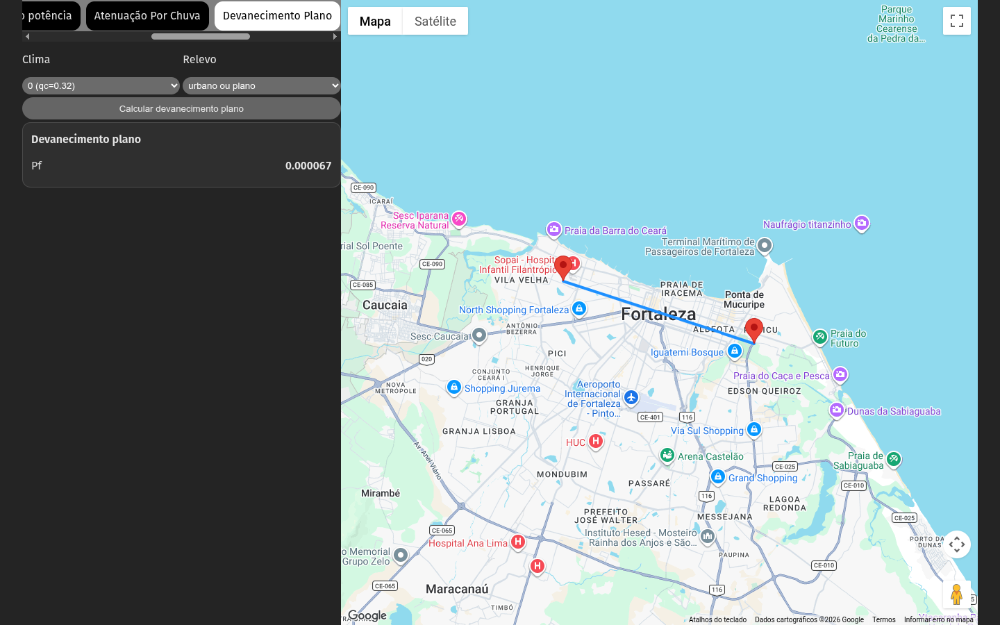
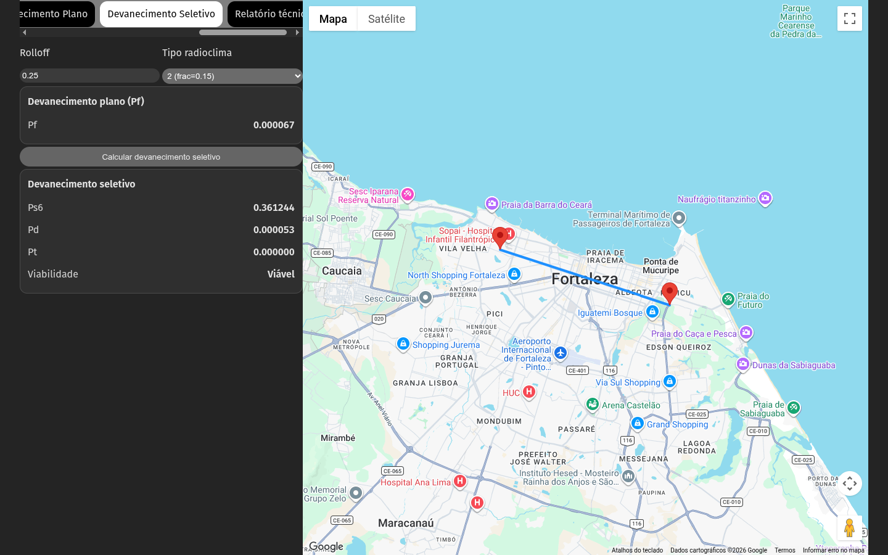
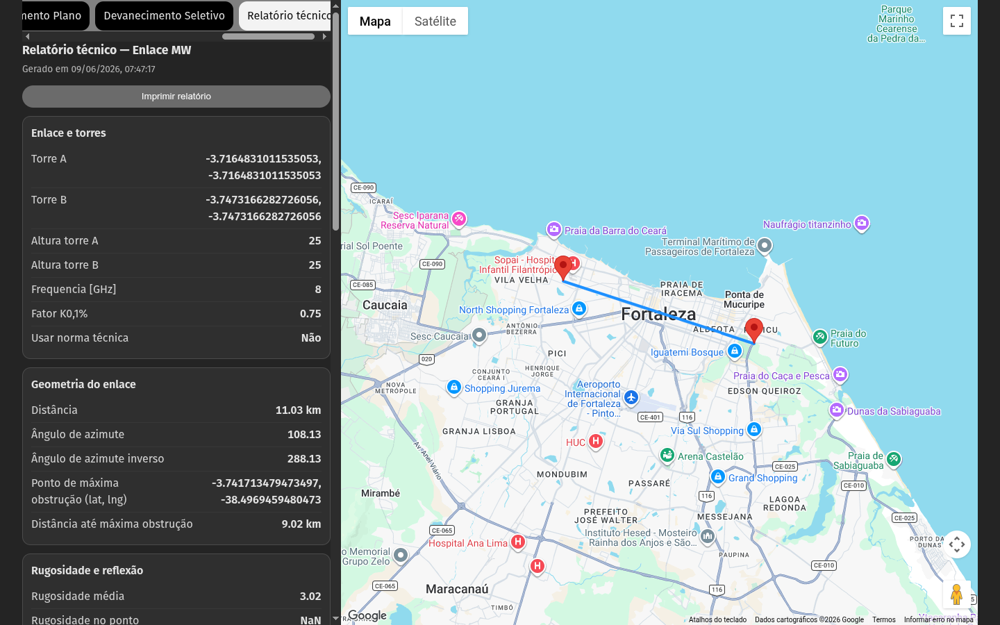

# Manual de utilização — tcc-remake

Aplicação web para **análise de enlaces de rádio ponto a ponto**: seleção de duas torres no mapa, perfil de terreno, elipsoide de Fresnel, rugosidade/reflexão, **balanço de potência** (margem de segurança com interferentes), **atenuação por chuva**, **devanecimento plano e seletivo**, e **relatório técnico** completo.

---

## Índice

1. [Introdução](#1-introdução)
2. [Requisitos e instalação](#2-requisitos-e-instalação)
3. [Visão geral da interface](#3-visão-geral-da-interface)
4. [Definir o enlace no mapa](#4-definir-o-enlace-no-mapa)
5. [Aba Geral](#5-aba-geral)
6. [Aba Dados do Enlace](#6-aba-dados-do-enlace)
7. [Aba Rugosidade e Raio Refletido](#7-aba-rugosidade-e-raio-refletido)
8. [Aba Balanço do potência](#8-aba-balanço-do-potência)
9. [Aba Atenuação Por Chuva](#9-aba-atenuação-por-chuva)
10. [Aba Devanecimento Plano](#10-aba-devanecimento-plano)
11. [Aba Devanecimento Seletivo](#11-aba-devanecimento-seletivo)
12. [Aba Relatório técnico](#12-aba-relatório-técnico)
13. [Resolução de problemas](#13-resolução-de-problemas)
14. [Glossário breve](#14-glossário-breve)
15. [Anexo: recriar as imagens do manual](#15-anexo-recriar-as-imagens-do-manual)

---

## 1. Introdução

O **tcc-remake** permite:

- Escolher **Torre A** (origem) e **Torre B** (destino) no **Google Maps**, com elevação do terreno nos pontos.
- Ver o **perfil ao longo do trajeto**, a **linha de visada** e, após configurar frequência e alturas, o **elipsoide de Fresnel** e o **raio refletido** nos gráficos.
- Consultar **distância**, **azimutes** (direto e inverso) e o **ponto de máxima obstrução** ao feixe.
- Calcular **potência nominal de recepção** (PNR) e **margem de segurança** face ao limiar de recepção, com **várias potências interferentes**.
- Estimar **atenuação por chuva** e **indisponibilidade** associada (polarizações horizontal e vertical), com base na taxa pluviométrica e na margem já calculada.
- Calcular **devanecimento plano (Pf)** a partir de parâmetros de clima e relevo.
- Calcular **devanecimento seletivo (Ps6, Pd, Pt)** com base no Pf e no tipo de radioclima.
- Gerar e imprimir um **relatório técnico** consolidado com todos os parâmetros e resultados do enlace.

Tecnologias: React, TypeScript, Vite, Google Maps (JavaScript + Elevação), Chart.js.

---

## 2. Requisitos e instalação

### Requisitos

- **Node.js** (recomendado 18 ou superior).
- **npm**.
- **Ligação à Internet** para carregar o mapa, imagens de satélite e o serviço de **elevação** do Google.
- Chave da **Google Maps JavaScript API** com APIs necessárias habilitadas (mapa, geometria, elevação). A chave está configurada na aplicação; em produção deve ser protegida por restrições de domínio e quotas.

### Instalar dependências

Na pasta raiz do projeto:

```bash
npm install
```

### Executar em desenvolvimento

```bash
npm run dev
```

Abra no navegador o endereço indicado no terminal (por omissão **http://localhost:5173**; se a porta estiver ocupada, o Vite pode usar **5174**, etc.).

### Compilar para produção (opcional)

```bash
npm run build
npm run preview
```

---

## 3. Visão geral da interface

A janela divide-se em duas zonas principais:

- **Coluna esquerda**: barra de **abas** (menu) no topo e, por baixo, o **painel** correspondente à aba selecionada (formulários, valores e gráficos).
- **Coluna direita**: **mapa interativo** (Google Maps), onde se marcam as torres e se visualiza a linha do enlace.


*Figura 1 — Layout principal: abas "geral", "Dados do Enlace", etc., e mapa.*

---

## 4. Definir o enlace no mapa

1. Com a aplicação aberta, **clique uma vez** no mapa para definir a **Torre A** (primeiro ponto). O marcador de origem é posicionado nesse local e a **elevação** desse ponto é obtida automaticamente.
2. **Clique novamente** noutro ponto do mapa para definir a **Torre B**. O segundo marcador move-se para esse local (cada novo clique **atualiza** a Torre B).
3. Entre as duas torres desenha-se uma **linha azul** (polilinha do enlace).


*Figura 2 — Exemplo após definir apenas a Torre A.*


*Figura 3 — Enlace completo com ambos os pontos.*

As **coordenadas** (latitude e longitude) são refletidas nos campos **Torre A** e **Torre B** na aba **geral** (sincronizadas com o mapa). Pode ainda ajustar coordenadas manualmente nos campos e usar o botão **"Gerar gráfico Manualmente"** para recalcular a partir dos valores introduzidos (ver seção seguinte).

---

## 5. Aba Geral

Na aba **geral** configura-se o enlace e visualizam-se os primeiros gráficos de perfil.

### Campos principais

| Campo | Descrição |
|--------|-----------|
| **Torre A** / **Torre B** | Coordenadas em graus (formato `lat, lng`), atualizadas pelos cliques no mapa. |
| **Altura torre A** / **Altura torre B** | Alturas das antenas (estruturas), usadas nos cálculos de visada e Fresnel. |
| **Frequencia [GHz]** | Frequência de trabalho; afeta o elipsoide de Fresnel. Valor inicial típico na app: **8** GHz. |
| **Fator K0,1%** | Parâmetro **K** para reflexão (condição de refratividade). Valor inicial típico: **0,75**. |
| **Usar norma técnica** | Caixa de seleção que influencia o cálculo "sem obstrução" (norma técnica ativa ou não). |


*Figura 4 — Aba Geral: coordenadas, alturas, frequência, K e ações.*

### Botões

- **Gerar gráfico Manualmente**: lê as coordenadas dos campos **Torre A** e **Torre B** e atualiza os pontos de cálculo (útil se editar as coordenadas à mão).
- **Recalcular Gráfico**: volta a gerar o elipsoide de Fresnel com a **frequência** atual.

### Gráficos

Há **dois** gráficos empilhados:

1. Perfil do terreno com **linha de visada** considerando obstruções ao longo do perfil.
2. Perfil com **linha de visada não obstruída** (referência sem a mesma obstrução ao terreno), incluindo o **elipsoide de Fresnel**.


*Figura 5 — Gráfico superior: elevação do trajeto e visada.*


*Figura 6 — Gráfico inferior: visada "não obstruída" com elipsoide de Fresnel.*

O eixo horizontal representa a progressão ao longo do trajeto; o eixo vertical, **elevação** (metros).

---

## 6. Aba Dados do Enlace

Esta aba mostra resultados **escalares** do enlace:

- **Distância** entre torres (em km).
- **Ângulo de azimute** (sentido A → B) e **azimute inverso** (B → A), em graus.
- O mesmo interruptor **Usar norma técnica** (coerente com a aba Geral).
- **Ponto de máxima obstrução**: coordenadas (lat, lng) e **distância** desde a origem ao longo do perfil (km).


*Figura 7 — Dados do enlace.*

---

## 7. Aba Rugosidade e Raio Refletido

Apresenta:

- **Rugosidade média** ao longo do trajeto, com **diagnóstico** "Rugoso" ou "Liso" conforme o valor calculado.
- **Distância até o ponto de reflexão**, **altura do ponto de reflexão**, **ângulo reflexivo** e **área de reflexão** (m²).
- Um **gráfico** com perfil, elipsoide de Fresnel (zonas superior e inferior) e **raio refletido**.


*Figura 8 — Rugosidade, reflexão e gráfico completo.*

Mantenha **Torre A**, **Torre B**, **frequência** e **K** coerentes com o cenário que pretende analisar; os gráficos dependem do trajeto e dos parâmetros físicos.

---

## 8. Aba Balanço do potência

Utilize esta aba para o **balanço de ligação** e a **margem de segurança**.

### Campos

| Campo | Descrição |
|-------|-----------|
| **Potência de Tx [dBm]** | Potência transmitida pelo equipamento. |
| **Limiar de Rx [dbm]** | Sensibilidade mínima aceitável do receptor (limiar de recepção). |
| **Ganho da antena A [dBi]** | Ganho da antena da estação A. |
| **Ganho da antena B [dBi]** | Ganho da antena da estação B. |
| **Comprimento total do guia de onda nas duas estações [m]** | Comprimento total do guia de onda/cabo coaxial somando as duas estações. |
| **Reserva técnica [m]** | Margem de reserva técnica do sistema (em metros equivalentes). |
| **Perda no Guia de onda [dB/m]** | Atenuação específica do guia de onda por metro. |
| **Perda por conector [dB]** | Perda por conector individual. |
| **Perdas nos duplexadores [dB]** | Perda introduzida pelos duplexadores do sistema. |
| **Quantidade de Potências interferentes** | Número **N** de sinais interferentes a considerar (0 a 10). |
| **Potência [dBm]** (×N) | Potência de cada interferente (valores em dBm, por exemplo `-98`). |

### Ação

1. Preencha todos os campos com valores realistas do seu enlace.
2. Clique em **Calcular Margem de segurança**.

### Resultados

Aparece um cartão **Margem de segurança** com:

| Resultado | Descrição |
|-----------|-----------|
| **Potência nominal de recepção** | Nível de recepção previsto na entrada do receptor (dBm), após todos os ganhos e perdas modelados. |
| **Limiar Degradado** | Limiar de recepção ajustado considerando as interferências modeladas (dBm). |
| **Margem de segurança** | Folga em dB entre a potência recebida e o limiar degradado. |


*Figura 9 — Balanço de potência e margem.*

> **Importante:** a margem calculada é utilizada internamente nas abas **Atenuação Por Chuva** e **Devanecimento Seletivo**. Calcule a margem **antes** de interpretar esses resultados.

---

## 9. Aba Atenuação Por Chuva

1. Introduza a **Taxa Pluviométrica para 0,01% do tempo (mm/h)** (intensidade de chuva de projeto).
2. Clique em **Calcular Taxa Pluviométrica**.

O painel mostra, separado por polarização **Horizontal** e **Vertical**:

| Resultado | Descrição |
|-----------|-----------|
| **Atenuação total** | Atenuação total causada pela chuva (dB). |
| **Indisponibilidade** | Fração de tempo de indisponibilidade associada ao modelo. |
| **Margem degrada por chuva** *(apenas Horizontal)* | Margem residual após a atenuação por chuva (dB). |
| **Viabilidade** | Indicação `Viável` ou `Inviável` para as condições calculadas. |


*Figura 10 — Atenuação por chuva e indisponibilidade.*

> **Nota:** o cálculo utiliza a **margem de segurança** obtida na aba **Balanço do potência**. Se ainda não tiver premido **Calcular Margem de segurança**, a margem pode estar vazia ou inválida e os resultados de chuva podem não ser fiáveis.

---

## 10. Aba Devanecimento Plano

Esta aba calcula a **probabilidade de devanecimento plano (Pf)** com base nas características climáticas e de relevo do trajeto.

### Campos

| Campo | Opções |
|-------|--------|
| **Clima** | `0 (qc=0.32)`, `1 (qc=0.68)`, `2 (qc=1.00)`, `3 (qc=1.32)` — quanto maior o valor, mais úmido/quente o clima. |
| **Relevo** | `agua`, `urbano ou plano`, `normal`, `morros`, `montanha` — tipo de superfície ao longo do trajeto. |

### Ação

Clique em **Calcular devanecimento plano**.

### Resultado

O cartão **Devanecimento plano** exibe:

- **Pf** — probabilidade de devanecimento plano (6 casas decimais).



*Figura 11 — Devanecimento plano: seleção de clima e relevo e resultado Pf.*

> O valor de **Pf** é utilizado automaticamente na aba **Devanecimento Seletivo**. Calcule o devanecimento plano antes de acessar a aba seguinte.

---

## 11. Aba Devanecimento Seletivo

Calcula a **probabilidade de devanecimento seletivo** (Ps6, Pd, Pt) utilizando o **Pf** já calculado e parâmetros adicionais do sistema de rádio.

### Pré-requisito

Antes de calcular, certifique-se de que o **Pf** foi calculado na aba **Devanecimento Plano**. Caso contrário, a aba exibirá o aviso:

> *"Calcule o devanecimento plano na aba anterior antes de continuar."*

Quando o Pf estiver disponível, ele é exibido no cartão **Devanecimento plano (Pf)** nesta aba.

### Campos

| Campo | Descrição |
|-------|-----------|
| **Rolloff** | Fator de rolloff do filtro do sistema de rádio (0 a 1). |
| **Tipo radioclima** | Tipo de ambiente de propagação: `1 (frac=0.05)` a `6 (frac=0.80)`. Valores maiores indicam maior fração de tempo com condições adversas. |

### Ação

Clique em **Calcular devanecimento seletivo**.

### Resultados

O cartão **Devanecimento seletivo** exibe:

| Resultado | Descrição |
|-----------|-----------|
| **Ps6** | Probabilidade de devanecimento seletivo (critério 6 dB). |
| **Pd** | Probabilidade de devanecimento de dispersão. |
| **Pt** | Probabilidade total de devanecimento. |
| **Viabilidade** | Indicação `Viável` ou `Inviável` para as condições calculadas. |



*Figura 12 — Devanecimento seletivo: Ps6, Pd, Pt e viabilidade.*

---

## 12. Aba Relatório técnico

A aba **Relatório técnico** consolida todos os parâmetros e resultados do enlace em um único documento legível, pronto para impressão.

### Conteúdo do relatório

O relatório é gerado automaticamente com as seguintes seções:

| Seção | Conteúdo |
|-------|----------|
| **Enlace e torres** | Torres A e B, alturas, frequência, fator K, norma técnica. |
| **Geometria do enlace** | Distância, azimutes, ponto de máxima obstrução. |
| **Rugosidade e reflexão** | Rugosidade, diagnóstico, distância/altura/ângulo/área de reflexão. |
| **Balanço de potência — parâmetros** | Todos os campos de entrada do balanço, incluindo interferentes. |
| **Balanço de potência — resultados** | PNR, limiar degradado, margem de segurança. |
| **Atenuação por chuva** | Taxa pluviométrica, atenuação/indisponibilidade/viabilidade (H e V), margem degradada horizontal. |
| **Devanecimento** | Clima, relevo, tipo radioclima, rolloff, Pf, Ps6/Pd/Pt, viabilidade. |

> Se o enlace ainda não estiver completamente definido (Torres A e B ausentes), o relatório exibirá um aviso de **"Enlace incompleto"**.

### Ação

Clique em **Imprimir relatório** para abrir a caixa de diálogo de impressão do navegador.



*Figura 13 — Relatório técnico consolidado com todos os parâmetros do enlace.*

---

## 13. Resolução de problemas

| Situação | O que verificar |
|-----------|-----------------|
| **Mapa cinzento ou sem carregar** | Internet; chave da API; consola do navegador (erros 403/429 por quota ou restrições). |
| **Gráficos vazios ou sem perfil** | Confirme que **Torre A** e **Torre B** estão definidas (cliques no mapa ou coordenadas válidas + **Gerar gráfico Manualmente**). |
| **Elevação não atualiza** | O serviço de elevação do Google pode falhar por quota ou bloqueio; tente mais tarde ou outra chave. |
| **Coordenadas estranhas nos campos Torre A/B** | Sincronização mapa ↔ campos: use de novo os cliques no mapa ou corrija manualmente e **Gerar gráfico Manualmente**. |
| **Chuva com valores estranhos** | Calcule antes a **margem** na aba **Balanço do potência**; confirme **frequência** e **distância** do enlace (mapa). |
| **Devanecimento seletivo sem resultado** | Calcule o **devanecimento plano** na aba anterior; o Pf é pré-requisito obrigatório. |
| **Relatório com aviso de enlace incompleto** | Defina as torres A e B no mapa antes de gerar o relatório. |

---

## 14. Glossário breve

- **Azimute**: ângulo horizontal da direção de uma torre em relação à outra (norte de referência da implementação).
- **Linha de visada**: trajetória reta entre antenas à altura considerada, projetada no perfil de terreno.
- **Elipsoide de Fresnel**: região ao redor da linha de visada que deve permanecer relativamente livre de obstáculos para boa qualidade de propagação; depende da **frequência** e da geometria do trajeto.
- **PNR (potência nominal de recepção)**: potência esperada no receptor após o balanço simplificado da aplicação.
- **Margem de segurança**: diferença em dB entre a potência recebida e o limiar degradado, com folga adicional conforme as fórmulas do código.
- **Rugosidade**: medida relacionada com a irregularidade do terreno ao longo do trajeto; influencia o diagnóstico de superfície "rugosa" vs "lisa" no ponto de reflexão.
- **Devanecimento plano (Pf)**: probabilidade de degradação do sinal por devanecimento plano, calculada a partir de parâmetros de clima e relevo.
- **Devanecimento seletivo (Ps6, Pd, Pt)**: probabilidades de devanecimento associadas à dispersão e ao tipo de radioclima; dependem do Pf.

---

## 15. Anexo: recriar as imagens do manual

As figuras estão em `outputs/images/`. Para gerá-las de novo usando o **Google Chrome** instalado na máquina:

1. Inicie o servidor: `npm run dev`.
2. Instale os browsers do Playwright (uma vez, se ainda não instalado):
   ```bash
   npx playwright install chrome
   ```
3. Execute o script (ajuste a URL se a porta não for 5173):
   ```bash
   MANUAL_BASE_URL=http://localhost:5174 npm run docs:capture-manual
   ```

O script `outputs/capture-manual-screenshots.mjs` usa o **Google Chrome** instalado na máquina (`channel: 'chrome'`), simula cliques no mapa, navega pelas abas, preenche valores de exemplo e captura 13 screenshots.

---

*Documento gerado para o projeto **tcc-remake**. Imagens capturadas automaticamente para ilustração; o conteúdo do mapa e dos gráficos depende da API do Google e dos dados em tempo real.*
